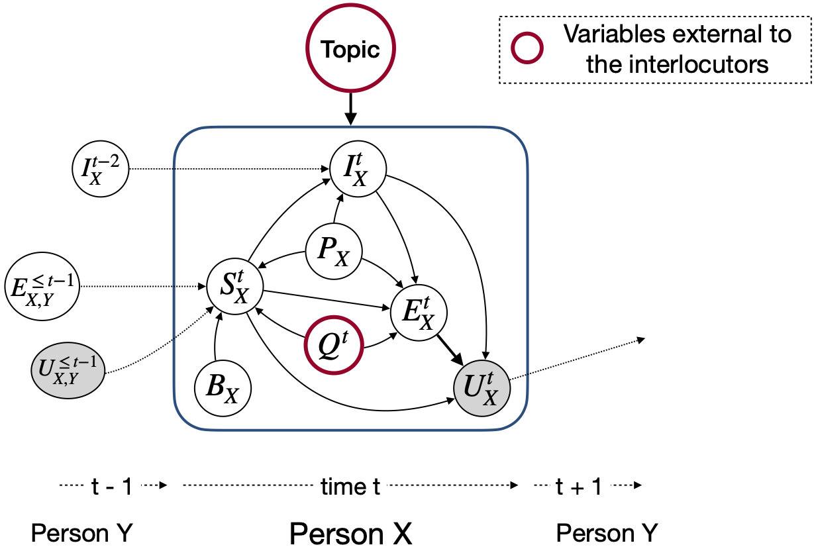
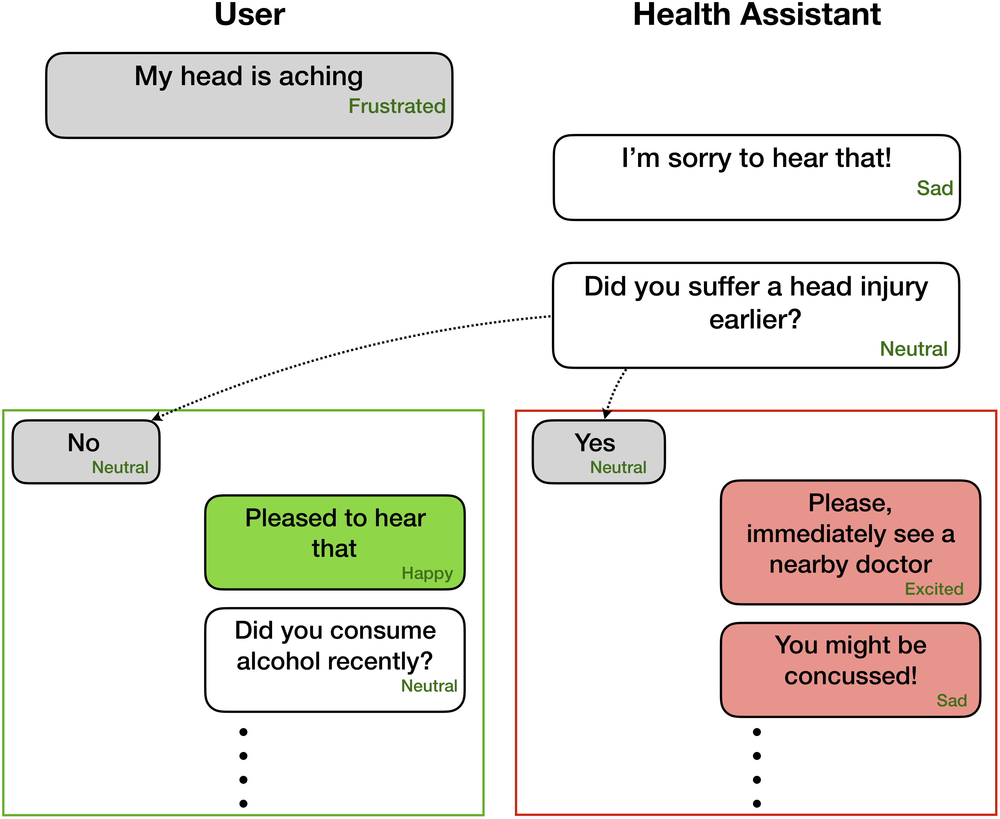
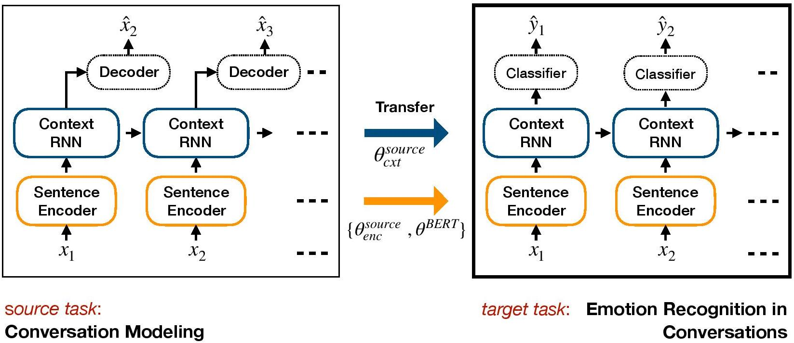
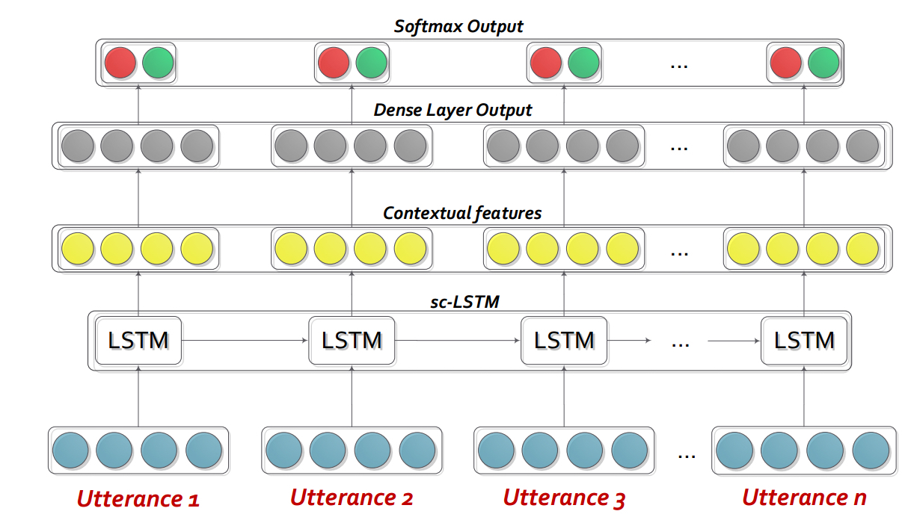
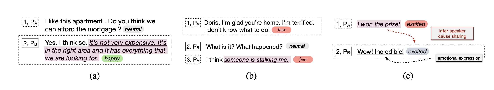
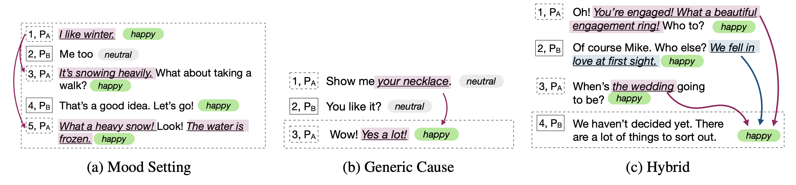
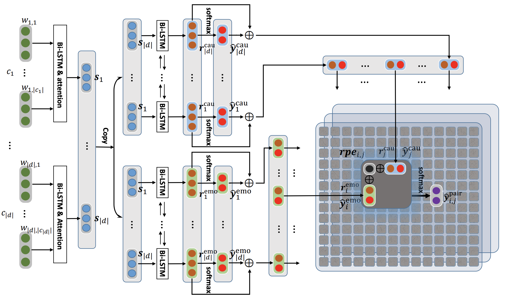
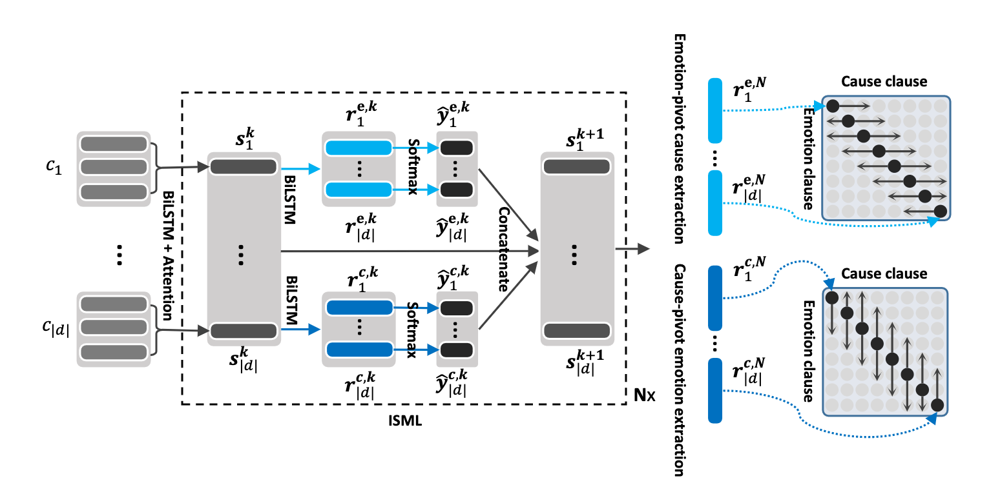

# Emotion Recognition in Conversations

## Note

``` For those enquiring about how to extract visual and audio features, please check this out: https://github.com/soujanyaporia/MUStARD```

## Updates 🔥 🔥 🔥 

| Date 	| Announcements 	|
|-	|-	|
| 10/03/2024  | If you are interested in IQ testing LLMs, check out our new work: [AlgoPuzzleVQA](https://github.com/declare-lab/puzzle-reasoning)
| 03/08/2021  | 🎆 🎆 We have released a new dataset M2H2: A Multimodal Multiparty Hindi Dataset For Humor Recognition in Conversations. Check it out: [M2H2](https://github.com/declare-lab/M2H2-dataset). The baselines for the M2H2 dataset are created based on DialogueRNN and bcLSTM. |
| 18/05/2021  | 🎆 🎆 We have released a new repo containing models to solve the problem of emotion cause recognition in conversations. Check it out: [emotion-cause-extraction](https://github.com/declare-lab/conv-emotion/tree/master/emotion-cause-extraction). Thanks to [Pengfei Hong](https://www.pengfei-hong.com/) for compiling this. |
| 24/12/2020  | 🎆 🎆 Interested in the topic of recognizing emotion causes in conversations? We have just released a dataset for this. Head over to [https://github.com/declare-lab/RECCON](https://github.com/declare-lab/RECCON).  |
| 06/10/2020  | 🎆 🎆 New paper and SOTA in Emotion Recognition in Conversations. Refer to the directory [COSMIC](./COSMIC) for the code. Read the paper -- [COSMIC: COmmonSense knowledge for eMotion Identification in Conversations](https://arxiv.org/pdf/2010.02795.pdf).  |
| 30/09/2020 	| New paper and baselines in utterance-level dialogue understanding have been released. Read our paper [Utterance-level Dialogue Understanding: An Empirical Study](https://arxiv.org/pdf/2009.13902.pdf). Fork the [codes](https://github.com/declare-lab/dialogue-understanding). 	|
| 26/07/2020 	| New DialogueGCN code has been released. Please visit https://github.com/declare-lab/conv-emotion/tree/master/DialogueGCN-mianzhang. All the credit goes to the Mian Zhang (https://github.com/mianzhang/) 	|
| 11/07/2020 	| Interested in reading the papers on ERC or related tasks such as sarcasm detection in conversations? We have compiled a comprehensive reading list for papers. Please visit https://github.com/declare-lab/awesome-emotion-recognition-in-conversations 	|
| 07/06/2020: 	| New state-of-the-art results for the ERC task will be released soon. 	|
| 07/06/2020: 	| The conv-emotion repo will be maintained on https://github.com/declare-lab/ 	|
| 22/12/2019: 	| Code for DialogueGCN has been released. 	|
| 11/10/2019: 	| New Paper: Conversational Transfer Learning for Emotion Recognition. 	|
| 09/08/2019: 	| New paper on Emotion Recognition in Conversation (ERC). 	|
| 06/03/2019: 	| Features and codes to train DialogueRNN on the MELD dataset have been released. 	|
| 20/11/2018: 	| End-to-end version of ICON and DialogueRNN have been released. 	|
---------------------------------------------------------------------------

COSMIC is the best performing model in this repo and please visit the links below to compare the models on different ERC datasets.

[](https://paperswithcode.com/sota/emotion-recognition-in-conversation-on-4?p=cosmic-commonsense-knowledge-for-emotion)

[](https://paperswithcode.com/sota/emotion-recognition-in-conversation-on-meld?p=cosmic-commonsense-knowledge-for-emotion)

[](https://paperswithcode.com/sota/emotion-recognition-in-conversation-on-3?p=cosmic-commonsense-knowledge-for-emotion)

[](https://paperswithcode.com/sota/emotion-recognition-in-conversation-on?p=cosmic-commonsense-knowledge-for-emotion)


This repository contains implementations for several emotion recognition in conversations methods as well algorithms for recognizing emotion cause in conversations:

- [Emotion Recognition in Conversations](#emotion-recognition-in-conversations)
  * [Data Format](#data-format)
  * [COSMIC (PyTorch)](#cosmic-commonsense-knowledge-for-emotion-identification-in-conversations)
  * [TL-ERC (PyTorch)](#tl-erc-emotion-recognition-in-conversations-with-transfer-learning-from-generative-conversation-modeling)
  * [DialogueGCN (PyTorch)](#dialoguegcn-a-graph-convolutional-neural-network-for-emotion-recognition-in-conversation)
  * [DialogueRNN (PyTorch)](#dialoguernn-an-attentive-rnn-for-emotion-detection-in-conversations)
  * [DialogueGCN-mianzhang (PyTorch)](#dialoguegcn-mianzhang-dialoguegcn-implementation-by-mian-zhang)
  * [ICON (tensorflow)](#icon)
  * [CMN (tensorflow)](#cmn)
  * [bc-LSTM-pytorch (PyTorch)](#bc-lstm-pytorch)
  * [bc-LSTM (keras)](#bc-lstm)
- [Recognizing Emotion Cause in Conversations](#recognizing-emotion-cause-in-conversations)
  * [ECPE-2D on RECCON dataset](#ecpe-2d-on-reccon-dataset)
  * [Rank-Emotion-Cause on RECCON dataset](#rank-emotion-cause-on-reccon-dataset)
  * [ECPE-MLL on RECCON dataset](#ecpe-mll-on-reccon-dataset)
  * [RoBERTa and SpanBERT Baselines on RECCON dataset](#roberta-and-spanbert-baselines-on-reccon-dataset)


Unlike other emotion detection models, these techniques consider the party-states and inter-party dependencies for modeling conversational context relevant to emotion recognition. The primary purpose of all these techniques are to pretrain an emotion detection model for empathetic dialogue generation.

<p align="center">
  
  <figcaption stype="display:table-caption;"><em>Interaction among different controlling variables during a
dyadic conversation between persons X and Y. Grey and white circles
represent hidden and observed variables, respectively. P represents
personality, U represents utterance, S represents interlocutor state, I
represents interlocutor intent, B represents background knowledge, Q represents external and sensory inputs, E represents emotion and Topic represents
topic of the conversation. This can easily be extended to multi-party
      conversations.</em></figcaption>
</p>


Emotion recognition can be very useful for empathetic and affective dialogue generation - 

<p align="center">
  
</p>


## Data Format

These networks expect emotion/sentiment label and speaker info for each utterance present in a dialogue like
```
Party 1: I hate my girlfriend (angry)
Party 2: you got a girlfriend?! (surprise)
Party 1: yes (angry)
```
However, the code can be adpated to perform tasks where only the preceding utterances are available, without their corresponding labels, as context and goal is to label only the present/target utterance. For example, the *context* is
```
Party 1: I hate my girlfriend
Party 2: you got a girlfriend?!
```
the *target* is
```
Party 1: yes (angry)
```
where the target emotion is _angry_.
Moreover, this code can also be molded to train the network in an end-to-end manner. We will soon push these useful changes.

## Present SOTA Results
<table>
  <tr>
    <th rowspan="2">Methods</th>
    <th>IEMOCAP</th>
    <th colspan="2">DailyDialog</th>
    <th colspan="2">MELD</th>
    <th colspan="2">EmoryNLP</th>
  </tr>

  <tr>
    <td>W-Avg F1</td>
    <td>Macro F1</td>
    <td>Micro F1</td>
    <td>W-Avg F1 (3-cls)</td>
    <td>W-Avg F1 (7-cls)</td>
    <td>W-Avg F1 (3-cls)</td>
    <td>W-Avg F1 (7-cls)</td>
  </tr>
  <tr>
    <td>RoBERTa</td>
    <td>54.55</td>
    <td>48.20</td>
    <td>55.16</td>
    <td>72.12</td>
    <td>62.02</td>
    <td>55.28</td>
    <td>37.29</td>
  </tr>
  <tr>
    <td>RoBERTa DialogueRNN</td>
    <td>64.76</td>
    <td>49.65</td>
    <td>57.32</td>
    <td>72.14</td>
    <td>63.61</td>
    <td>55.36</td>
    <td>37.44</td>
  </tr>
  <tr>
    <td><b>RoBERTa COSMIC</b></td>
   <td><b>65.28</b></td>
   <td><b>51.05</b></td>
   <td><b>58.48</b></td>
   <td><b>73.20</b></td>
   <td><b>65.21</b></td>
   <td><b>56.51</b></td>
   <td><b>38.11</b></td>
  </tr>

</table>

## COSMIC: COmmonSense knowledge for eMotion Identification in Conversations

[_COSMIC_](https://github.com/declare-lab/conv-emotion) addresses the task of utterance level emotion recognition in conversations using commonsense knowledge. It is a new framework that incorporates different elements of commonsense such as mental states, events, and causal relations, and build upon them to learn interactions between interlocutors participating in a conversation. Current state-of-the-art methods often encounter difficulties in context propagation, emotion shift detection, and differentiating between related emotion classes. By learning distinct commonsense representations, COSMIC addresses these challenges and achieves new state-of-the-art results for emotion recognition on four different benchmark conversational datasets. 


### Execution

First download the RoBERTa and COMET features [here](https://drive.google.com/file/d/1TQYQYCoPtdXN2rQ1mR2jisjUztmOzfZr/view?usp=sharing) and keep them in appropriate directories in `COSMIC/erc-training`. Then training and evaluation on the four datasets are to be done as follows:

1. IEMOCAP: `python train_iemocap.py --active-listener`
2. DailyDialog: `python train_dailydialog.py --active-listener --class-weight --residual`
3. MELD Emotion: `python train_meld.py --active-listener --attention simple --dropout 0.5 --rec_dropout 0.3 --lr 0.0001 --mode1 2 --classify emotion --mu 0 --l2 0.00003 --epochs 60`
4. MELD Sentiment: `python train_meld.py --active-listener --class-weight --residual --classify sentiment`
5. EmoryNLP Emotion: `python train_emorynlp.py --active-listener --class-weight --residual`
6. EmoryNLP Sentiment: `python train_emorynlp.py --active-listener --class-weight --residual --classify sentiment`


### Citation

Please cite the following [paper](https://arxiv.org/pdf/2010.02795.pdf) if you find this code useful in your work.

```bash
COSMIC: COmmonSense knowledge for eMotion Identification in Conversations. D. Ghosal, N. Majumder, A. Gelbukh, R. Mihalcea, & S. Poria.  Findings of EMNLP 2020.
```


## TL-ERC: Emotion Recognition in Conversations with Transfer Learning from Generative Conversation Modeling

[_TL-ERC_](https://arxiv.org/pdf/1910.04980.pdf) is a transfer learning-based framework for ERC. It pre-trains a generative dialogue model and transfers context-level weights that include affective knowledge into the target discriminative model for ERC.

<p align="center">
  
</p>

### Setting up

1. Setup an environment with Conda:

    ```bash
    conda env create -f environment.yml
    conda activate TL_ERC
    cd TL_ERC
    python setup.py
    ```
2. Download dataset files [IEMOCAP](https://drive.google.com/file/d/1nufbrBJ-LtcROv1MviCHFI7tQE3JnqQR/view?usp=sharing), [DailyDialog](https://drive.google.com/file/d/13rHLtAMmDsiCP1hZwWqMNcrtkmZF_hK3/view?usp=sharing) and store them in `./datasets/`.

3. Download the pre-trained weights of HRED on [Cornell](https://drive.google.com/file/d/1OXtnyJ5nDMmK75L9kEQvKPIyO0xzyeVC/view?usp=sharing) and [Ubuntu](https://drive.google.com/file/d/1T2HLfSvWr7CSrhBuE193XRRXwfLkO_aK/view?usp=sharing) datasets and store them in `./generative_weights/`

4. [Optional]: To train new generative weights from dialogue models, refer to https://github.com/ctr4si/A-Hierarchical-Latent-Structure-for-Variational-Conversation-Modeling . 


### Run the ERC classifier with pre-trained weights

1. `cd bert_model`
2. `python train.py --load_checkpoint=../generative_weights/cornell_weights.pkl --data=iemocap`.   
    -  Change `cornell` to `ubuntu` and `iemocap` to `dailydialog` for other dataset combinations.
    -  Drop `load_checkpoint` to avoid initializing contextual weights.
    -  To modify hyperparameters, check `configs.py`

### [Optional] Create ERC Dataset splits

1. Set [glove](http://nlp.stanford.edu/data/glove.840B.300d.zip) path in the preprocessing files.
2. `python iemocap_preprocess.py`. Similarly for `dailydialog`.

### Citation

Please cite the following paper if you find this code useful in your work.

```bash
Conversational transfer learning for emotion recognition. Hazarika, D., Poria, S., Zimmermann, R., & Mihalcea, R. (2020). Information Fusion.
```
## DialogueGCN: A Graph Convolutional Neural Network for Emotion Recognition in Conversation

[_DialogueGCN_](https://arxiv.org/pdf/1908.11540.pdf) (Dialogue Graph Convolutional Network), is a graph neural network based approach to ERC. We leverage self and inter-speaker dependency of the interlocutors to model conversational context for emotion recognition. Through the graph network, DialogueGCN addresses context propagation issues present in the current RNN-based methods. DialogueGCN is naturally suited for multi-party dialogues.


### Requirements

- Python 3
- PyTorch 1.0
- PyTorch Geometric 1.3
- Pandas 0.23
- Scikit-Learn 0.20
- TensorFlow (optional; required for tensorboard)
- tensorboardX (optional; required for tensorboard)

### Execution

__Note__: PyTorch Geometric makes heavy usage of CUDA atomic operations and is a source of non-determinism. To reproduce the results reported in the paper, we recommend to use the following execution command. Note that this script will execute in CPU. We obatined weighted average F1 scores of 64.67 in our machine and 64.44 in Google colaboratory for IEMOCAP dataset with the following command.

1. _IEMOCAP_ dataset: `python train_IEMOCAP.py --base-model 'LSTM' --graph-model --nodal-attention --dropout 0.4 --lr 0.0003 --batch-size 32 --class-weight --l2 0.0 --no-cuda`

### Citation

Please cite the following paper if you find this code useful in your work.

```bash
DialogueGCN: A Graph Convolutional Neural Network for Emotion Recognition in Conversation. D. Ghosal, N. Majumder, S. Poria, N. Chhaya, & A. Gelbukh. EMNLP-IJCNLP (2019), Hong Kong, China.
```


## DialogueGCN-mianzhang: DialogueGCN Implementation by Mian Zhang
Pytorch implementation to paper "DialogueGCN: A Graph Convolutional Neural Network for Emotion Recognition in Conversation". 

### Running
You can run the whole process very easily. Take the IEMOCAP corpus for example:

### Step 1: Preprocess.
```bash
./scripts/iemocap.sh preprocess
```

### Step 2: Train.
```bash
./scripts/iemocap.sh train
```

### Requirements

- Python 3
- PyTorch 1.0
- PyTorch Geometric 1.4.3
- Pandas 0.23
- Scikit-Learn 0.20

### Performance Comparision

-|Dataset|Weighted F1
:-:|:-:|:-:
Original|IEMOCAP|64.18%
This Implementation|IEMOCAP|64.10%

### Credits

Mian Zhang (Github: mianzhang)

### Citation

Please cite the following paper if you find this code useful in your work.

```bash
DialogueGCN: A Graph Convolutional Neural Network for Emotion Recognition in Conversation. D. Ghosal, N. Majumder, S. Poria, N. Chhaya, & A. Gelbukh. EMNLP-IJCNLP (2019), Hong Kong, China.
```


## DialogueRNN: An Attentive RNN for Emotion Detection in Conversations

[_DialogueRNN_](https://arxiv.org/pdf/1811.00405.pdf) is basically a customized recurrent neural network (RNN) that
profiles each speaker in a conversation/dialogue on the fly, while models the
context of the conversation at the same time. This model can easily be extended to
multi-party scenario. Also, it can be used as a pretraining model for empathetic
dialogue generation. 

__Note__: the default settings (hyperparameters and commandline arguments) in the code are meant for BiDialogueRNN+Att. The user needs to optimize the settings for other the variants and changes.

### Requirements

- Python 3
- PyTorch 1.0
- Pandas 0.23
- Scikit-Learn 0.20
- TensorFlow (optional; required for tensorboard)
- tensorboardX (optional; required for tensorboard)

### Dataset Features

Please extract the contents of `DialogueRNN_features.zip`.

### Execution

1. _IEMOCAP_ dataset: `python train_IEMOCAP.py <command-line arguments>`
2. _AVEC_ dataset: `python train_AVEC.py <command-line arguments>`

### Command-Line Arguments

-  `--no-cuda`: Does not use GPU
-  `--lr`: Learning rate
-  `--l2`: L2 regularization weight
-  `--rec-dropout`: Recurrent dropout
-  `--dropout`: Dropout
-  `--batch-size`: Batch size
-  `--epochs`: Number of epochs
-  `--class-weight`: class weight (not applicable for AVEC)
-  `--active-listener`: Explicit lisnener mode
-  `--attention`: Attention type
-  `--tensorboard`: Enables tensorboard log
-  `--attribute`: Attribute 1 to 4 (only for AVEC; 1 = valence, 2 = activation/arousal, 3 = anticipation/expectation, 4 = power)

### Citation

Please cite the following paper if you find this code useful in your work.

```bash
DialogueRNN: An Attentive RNN for Emotion Detection in Conversations. N. Majumder, S. Poria, D. Hazarika, R. Mihalcea, E. Cambria, and G. Alexander. AAAI (2019), Honolulu, Hawaii, USA
```

## ICON

Interactive COnversational memory Network (ICON) is a multimodal emotion detection framework that extracts multimodal features from conversational videos and hierarchically models the \textit{self-} and \textit{inter-speaker} emotional influences into global memories. Such memories generate contextual summaries which aid in predicting the emotional orientation of utterance-videos.
<p align="center">
  
</p>

### Requirements

- python 3.6.5
- pandas==0.23.3
- tensorflow==1.9.0
- numpy==1.15.0
- scikit_learn==0.20.0

### Execution
1. `cd ICON`

2. Unzip the data as follows:  
    - Download the features for IEMOCAP using this [link](https://drive.google.com/file/d/1zWCN2oMdibFkOkgwMG2m02uZmSmynw8c/view?usp=sharing).
    - Unzip the folder and place it in the location: `/ICON/IEMOCAP/data/`. Sample command to achieve this: `unzip  {path_to_zip_file} -d ./IEMOCAP/`
3. Train the ICON model:
    - `python train_iemocap.py` for IEMOCAP

### Citation
```bash
ICON: Interactive Conversational Memory Networkfor Multimodal Emotion Detection. D. Hazarika, S. Poria, R. Mihalcea, E. Cambria, and R. Zimmermann. EMNLP (2018), Brussels, Belgium
```

## CMN
[_CMN_](http://aclweb.org/anthology/N18-1193) is a neural framework for emotion detection in dyadic conversations. It leverages mutlimodal signals from text, audio and visual modalities. It specifically incorporates speaker-specific dependencies into its architecture for context modeling. Summaries are then generated from this context using multi-hop memory networks.


### Requirements

- python 3.6.5
- pandas==0.23.3
- tensorflow==1.9.0
- numpy==1.15.0
- scikit_learn==0.20.0

### Execution
1. `cd CMN`

2. Unzip the data as follows:  
    - Download the features for IEMOCAP using this [link](https://drive.google.com/file/d/1zWCN2oMdibFkOkgwMG2m02uZmSmynw8c/view?usp=sharing).
    - Unzip the folder and place it in the location: `/CMN/IEMOCAP/data/`. Sample command to achieve this: `unzip {path_to_zip_file} -d ./IEMOCAP/`
3. Train the ICON model:
    - `python train_iemocap.py` for IEMOCAP

### Citation

Please cite the following paper if you find this code useful in your work.

```bash
Hazarika, D., Poria, S., Zadeh, A., Cambria, E., Morency, L.P. and Zimmermann, R., 2018. Conversational Memory Network for Emotion Recognition in Dyadic Dialogue Videos. In Proceedings of the 2018 Conference of the North American Chapter of the Association for Computational Linguistics: Human Language Technologies, Volume 1 (Long Papers) (Vol. 1, pp. 2122-2132).
```

## bc-LSTM-pytorch
[_bc-LSTM-pytorch_](http://www.aclweb.org/anthology/P17-1081) is a network for using context to detection emotion of an utterance in a dialogue. The model is simple but efficient which only uses a LSTM to model the temporal relation among the utterances. In this repo we gave the data of Semeval 2019 Task 3. We have used and provided the data released by Semeval 2019 Task 3 - "Emotion Recognition in Context" organizers. In this task only 3 utterances have been provided - utterance1 (user1), utterance2 (user2), utterance3 (user1) consecutively. The task is to predict the emotion label of utterance3. Emotion label of each utterance have not been provided. However, if your data contains emotion label of each utterance then you can still use this code and adapt it accordingly. Hence, this code is still aplicable for the datasets like MOSI, MOSEI, IEMOCAP, AVEC, DailyDialogue etc. bc-LSTM does not make use of speaker information like CMN, ICON and DialogueRNN.
<p align="center">
  
</p>

### Requirements

- python 3.6.5
- pandas==0.23.3
- PyTorch 1.0
- numpy==1.15.0
- scikit_learn==0.20.0

### Execution
1. `cd bc-LSTM-pytorch`

2. Train the bc-LSTM model:
    - `python train_IEMOCAP.py` for IEMOCAP

### Citation

Please cite the following paper if you find this code useful in your work.

```bash
Poria, S., Cambria, E., Hazarika, D., Majumder, N., Zadeh, A. and Morency, L.P., 2017. Context-dependent sentiment analysis in user-generated videos. In Proceedings of the 55th Annual Meeting of the Association for Computational Linguistics (Volume 1: Long Papers) (Vol. 1, pp. 873-883).
```

## bc-LSTM
Keras implementation of [_bc-LSTM_](http://www.aclweb.org/anthology/P17-1081).

### Requirements

- python 3.6.5
- pandas==0.23.3
- tensorflow==1.9.0
- numpy==1.15.0
- scikit_learn==0.20.0
- keras==2.1

### Execution
1. `cd bc-LSTM`

2. Train the bc-LSTM model:
    - `python baseline.py -config testBaseline.config` for IEMOCAP

### Citation

Please cite the following paper if you find this code useful in your work.

```bash
Poria, S., Cambria, E., Hazarika, D., Majumder, N., Zadeh, A. and Morency, L.P., 2017. Context-dependent sentiment analysis in user-generated videos. In Proceedings of the 55th Annual Meeting of the Association for Computational Linguistics (Volume 1: Long Papers) (Vol. 1, pp. 873-883).
```

# Recognizing Emotion Cause in Conversations

This repository also contains implementations of different architectures to detect emotion cause in conversations.

<p align="center">
  
  <figcaption stype="display:table-caption;"><em> (a) No context. (b) Unmentioned Latent Cause. (c) Distinguishing emotion cause from emotional expressions.</em></figcaption>
</p>

<p align="center">
  
  <figcaption stype="display:table-caption;"><em> (a) Self-contagion. (b) The cause of the emotion is primarily due to a stable mood of the speaker that was induced in the previous dialogue turns; (c) The hybrid type with both inter-personal emotional influence and self-contagion.</em></figcaption>
</p>

## Baseline Results on [RECCON](https://github.com/declare-lab/RECCON) dataset (DailyDialog Fold)

| Model 	| emo_f1 	| pos_f1 	| neg_f1 	| macro_avg 	|
|-	|-	|-	|-	|-	|
| ECPE-2d cross_road<br>(0 transform layer) 	| 52.76 	| 52.39 	| 95.86 	| 73.62 	|
| ECPE-2d window_constrained<br>(1 transform layer) 	| 70.48 	| 48.80 	| 93.85 	| 71.32 	|
| ECPE-2d cross_road<br>(2 transform layer) 	| 52.76 	| 55.50 	| 94.96 	| 75.23 	|
| ECPE-MLL | - | 48.48 | 94.68 | 71.58 |
| Rank Emotion Cause | - | 33.00 |  97.30 |  65.15 |
| RoBERTa-base | - | 64.28 |  88.74 |  76.51 |
| RoBERTa-large | - | 66.23 |  87.89 |  77.06 |

## ECPE-2D on [RECCON](https://github.com/declare-lab/RECCON) dataset

<p align="center">
  
</p>

Citation:
Please cite the following papers if you use this code.
- Recognizing Emotion Cause in Conversations. Soujanya Poria, Navonil Majumder, Devamanyu Hazarika, Deepanway Ghosal, Rishabh Bhardwaj, Samson Yu Bai Jian, Romila Ghosh, Niyati Chhaya, Alexander Gelbukh, Rada Mihalcea. Arxiv (2020). [[pdf](https://arxiv.org/pdf/2012.11820.pdf)]
- Zixiang Ding, Rui Xia, Jianfei Yu. ECPE-2D: Emotion-Cause Pair Extraction based on Joint Two-Dimensional Representation, Interaction and Prediction. ACL 2020. [[pdf](https://www.aclweb.org/anthology/2020.acl-main.288.pdf)]

## Rank-Emotion-Cause on [RECCON](https://github.com/declare-lab/RECCON) dataset

<p align="center">
  
</p>

Citation:
Please cite the following papers if you use this code.
- Recognizing Emotion Cause in Conversations. Soujanya Poria, Navonil Majumder, Devamanyu Hazarika, Deepanway Ghosal, Rishabh Bhardwaj, Samson Yu Bai Jian, Romila Ghosh, Niyati Chhaya, Alexander Gelbukh, Rada Mihalcea. Arxiv (2020). [[pdf](https://arxiv.org/pdf/2012.11820.pdf)]
- **Effective Inter-Clause Modeling for End-to-End Emotion-Cause Pair Extraction**. In *Proc. of ACL 2020: The 58th Annual Meeting of the Association for Computational Linguistics*, pages 3171--3181. [[pdf](https://www.aclweb.org/anthology/2020.acl-main.289/)] 


## ECPE-MLL on [RECCON](https://github.com/declare-lab/RECCON) dataset


<p align="center">
  
</p>

Citation:
Please cite the following papers if you use this code.
- Recognizing Emotion Cause in Conversations. Soujanya Poria, Navonil Majumder, Devamanyu Hazarika, Deepanway Ghosal, Rishabh Bhardwaj, Samson Yu Bai Jian, Romila Ghosh, Niyati Chhaya, Alexander Gelbukh, Rada Mihalcea. Arxiv (2020). [[pdf](https://arxiv.org/pdf/2012.11820.pdf)]
- Zixiang Ding, Rui Xia, Jianfei Yu. End-to-End Emotion-Cause Pair Extraction based on SlidingWindow Multi-Label Learning. EMNLP 2020.[[pdf](https://www.aclweb.org/anthology/2020.emnlp-main.290.pdf)]

## RoBERTa and SpanBERT Baselines on [RECCON](https://github.com/declare-lab/RECCON) dataset

The RoBERTa and SpanBERT baselines as explained in the original RECCON paper. Refer to [this](https://arxiv.org/pdf/2012.11820.pdf).

Citation:
Please cite the following papers if you use this code.
- Recognizing Emotion Cause in Conversations. Soujanya Poria, Navonil Majumder, Devamanyu Hazarika, Deepanway Ghosal, Rishabh Bhardwaj, Samson Yu Bai Jian, Romila Ghosh, Niyati Chhaya, Alexander Gelbukh, Rada Mihalcea. Arxiv (2020). [[pdf](https://arxiv.org/pdf/2012.11820.pdf)]

